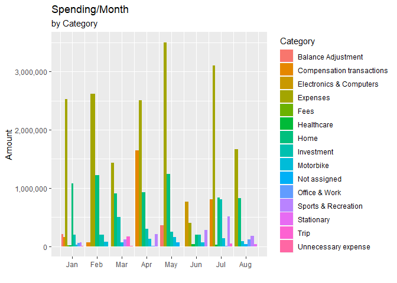
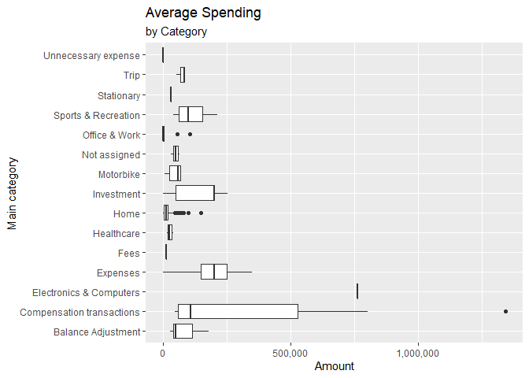
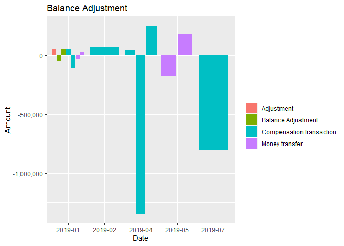

Budget Book Analysis
================
Raka Adinugraha
November 21, 2019

# About the data

This data is a record of my personal spending from January 2019 to
August 2019. During this period, I record every spending that occurs in
every account that I have which is, cash money, bank account, and
various saving box. The data itself was exported from ‘My Budget Book’
android app in my phone, and the all amount is in IDR. We mainly gonna
be focus the analysis on monthly basis.

# Purpose

The purpose of this analysis is to see the spending trend over this
period and make it as a guidefor future spending decisions to improve
finances conditions. Other than that, it also uses as an indicator of
how good or not I at doing the records of the spending.

# Processing the data

The datasets turned into a tibble. Preset Date and Amount as date and
number type respectively. The rest of the column will become character
type by default.

``` r
budget <- read_csv2("January-august_2019.csv", col_types = cols(
  Date = col_date(format = "%m/%d/%Y"),
  Amount = col_number()
))
```

    ## Using ',' as decimal and '.' as grouping mark. Use read_delim() for more control.

``` r
head(budget)
```

    ## # A tibble: 6 x 7
    ##   Date       Title     Comment `Main category` Subcategory Account   Amount
    ##   <date>     <chr>     <chr>   <chr>           <chr>       <chr>      <dbl>
    ## 1 2019-01-01 This sof~ <NA>    Office & Work   Software    Cash Mo~  -55000
    ## 2 2019-01-02 Extra fr~ <NA>    Income          <NA>        Saving ~    2000
    ## 3 2019-01-02 Yogurt    <NA>    Home            Food        Cash Mo~   -8100
    ## 4 2019-01-02 Dinner    <NA>    Home            Food        Cash Mo~  -18000
    ## 5 2019-01-02 Weekly c~ <NA>    Expenses        <NA>        Bank Ma~ -300000
    ## 6 2019-01-02 Weekly c~ <NA>    Expenses        <NA>        Cash Mo~  300000

Upon looking to the dataset, we can see there is some element of it we
can tweak. First we can see that ‘Main category’ column name have a
space in it, that in my experience could be problematic when try to use
it for plotting, so we need to change it. We also add new ‘Month\_Year’
column that will help our further analysis.

``` r
budget <- rename(budget, Main_category = 'Main category')
budget$Month_Year <- format(as_date(budget$Date), '%Y-%m')
head(budget)
```

    ## # A tibble: 6 x 8
    ##   Date       Title Comment Main_category Subcategory Account  Amount
    ##   <date>     <chr> <chr>   <chr>         <chr>       <chr>     <dbl>
    ## 1 2019-01-01 This~ <NA>    Office & Work Software    Cash M~  -55000
    ## 2 2019-01-02 Extr~ <NA>    Income        <NA>        Saving~    2000
    ## 3 2019-01-02 Yogu~ <NA>    Home          Food        Cash M~   -8100
    ## 4 2019-01-02 Dinn~ <NA>    Home          Food        Cash M~  -18000
    ## 5 2019-01-02 Week~ <NA>    Expenses      <NA>        Bank M~ -300000
    ## 6 2019-01-02 Week~ <NA>    Expenses      <NA>        Cash M~  300000
    ## # ... with 1 more variable: Month_Year <chr>

Next we create several dataframe that will be use for our analysis.
spending\_data dataframe will consist of all of our spending data. In
this dataframe we also remove ‘Comment’ column because it containt
mostly about detailed note like the amount of certain thing bought, or
how much discount we get. On top of it, not every entry have their
comment column filed. Of course we can make further analysis about it,
but it was beyond the scope of this analysis.

``` r
budget %>%
  filter(Main_category != 'Income' & Main_category != 'Saving') %>%
  select(-Comment) -> spending_data
head(spending_data)
```

    ## # A tibble: 6 x 7
    ##   Date       Title   Main_category   Subcategory Account  Amount Month_Year
    ##   <date>     <chr>   <chr>           <chr>       <chr>     <dbl> <chr>     
    ## 1 2019-01-01 This s~ Office & Work   Software    Cash M~  -55000 2019-01   
    ## 2 2019-01-02 Yogurt  Home            Food        Cash M~   -8100 2019-01   
    ## 3 2019-01-02 Dinner  Home            Food        Cash M~  -18000 2019-01   
    ## 4 2019-01-02 Weekly~ Expenses        <NA>        Bank M~ -300000 2019-01   
    ## 5 2019-01-02 Weekly~ Expenses        <NA>        Cash M~  300000 2019-01   
    ## 6 2019-01-02 Expense Unnecessary ex~ <NA>        Cash M~   -2000 2019-01

In the investment dataframe, containt all data of the investment that we
made during the time period. We remove ‘Subcategory’ column because all
entry have the same subcategory.

``` r
spending_data %>%
  filter(Main_category == 'Investment') %>%
  select(-Subcategory) -> investment
head(investment)
```

    ## # A tibble: 6 x 6
    ##   Date       Title           Main_category Account       Amount Month_Year
    ##   <date>     <chr>           <chr>         <chr>          <dbl> <chr>     
    ## 1 2019-01-24 Gold investment Investment    Bank Mandiri -200000 2019-01   
    ## 2 2019-02-09 Gold investment Investment    Bank Mandiri -200000 2019-02   
    ## 3 2019-03-01 Gold investment Investment    Bank Mandiri -255000 2019-03   
    ## 4 2019-03-10 Mutual Funds    Investment    Bank Mandiri -200000 2019-03   
    ## 5 2019-03-11 Mutual Funds    Investment    Bank Mandiri  -50000 2019-03   
    ## 6 2019-04-01 Mutual Funds    Investment    Bank Mandiri  -50000 2019-04

As it name suggest, the income dataframe contain all our income labeled
transaction.

``` r
income <- filter(budget, Main_category == 'Income')
head(income)
```

    ## # A tibble: 6 x 8
    ##   Date       Title Comment Main_category Subcategory Account Amount
    ##   <date>     <chr> <chr>   <chr>         <chr>       <chr>    <dbl>
    ## 1 2019-01-02 Extr~ <NA>    Income        <NA>        Saving~ 2.00e3
    ## 2 2019-01-07 Bonus <NA>    Income        <NA>        Bank M~ 4.00e4
    ## 3 2019-01-29 Inco~ <NA>    Income        Income      Bank M~ 1.70e6
    ## 4 2019-02-26 Inco~ <NA>    Income        Income      Bank M~ 1.70e6
    ## 5 2019-03-09 Gift  <NA>    Income        Income      Bank M~ 2.00e5
    ## 6 2019-03-30 Inco~ <NA>    Income        Income      Bank M~ 1.70e6
    ## # ... with 1 more variable: Month_Year <chr>

savings consist the data of small amount of money we save.

``` r
budget %>%
  filter(Main_category == 'Saving') %>%
  select(-Comment) -> savings
head(savings)
```

    ## # A tibble: 6 x 7
    ##   Date       Title     Main_category Subcategory Account  Amount Month_Year
    ##   <date>     <chr>     <chr>         <chr>       <chr>     <dbl> <chr>     
    ## 1 2019-01-03 4K Routi~ Saving        <NA>        Cash Mo~  -4000 2019-01   
    ## 2 2019-01-03 4K Routi~ Saving        <NA>        Saving ~   4000 2019-01   
    ## 3 2019-01-10 4K Routi~ Saving        <NA>        Cash Mo~  -4000 2019-01   
    ## 4 2019-01-10 4K Routi~ Saving        <NA>        Saving ~   4000 2019-01   
    ## 5 2019-01-17 4K Routi~ Saving        <NA>        Cash Mo~  -4000 2019-01   
    ## 6 2019-01-17 4K Routi~ Saving        <NA>        Saving ~   4000 2019-01

# Visualization

The visualization of the data can help the analysis by giving more
insight to the data itself. I use ggplot2 as the main tool for
visualizing the data, and the tidyverse package library for manipulating
the data.

By using plotly with its ggplotly() function to the ggplot output, we
can convert the ggplot output to plotly output to use hovering tool to
see the detail of every point. Unfortunately, this does not work with
the .rmd file for github document. But it can be reproduce in R Studio
viewer tab, by simply using ggplotly() to their respective plot output.

## Spending over time

With this visualization we can see the entierty of the spending data.
With this we also can identifying every spike in our spending and
determined what is the necessary step we can take to prevent that in the
future, if possible. There is a consistent spike in every month, and
another major spike outlier that we can spot.

``` r
# Spending over time
spending_data %>%
  ggplot(mapping = aes(x = Date, y = abs(Amount))) +
  geom_line() +
  labs(y = "Amount") +
  scale_y_continuous(labels = comma) -> P

# ggplotly(P)
```

## Spending by Category

This section we will see several plots of spending divided by the Main
category.

### Spending/Month by Category

With this plot we can see the highest spending happen in April, mainly
contributed by the general expenses Main category and compensation
transaction. The expenses category have a relatively high amount compare
to others spending category, almost all was above to 2 million only in
August it was below. We also can see Home category also have consistenly
high amount in all month, only in June it dip below 500K.

``` r
spending_data %>%
  group_by(Month = month(Date), Year = year(Date), Main_category) %>%
  summarise(Amount = sum(abs(Amount))) %>%
  ggplot(mapping = aes(x = Month, y = Amount, fill = Main_category)) +
  geom_bar(stat = 'identity', position = position_dodge()) +
  labs(x = "", title = "Spending/Month", subtitle =  "by Category", fill = "Category") +
  scale_x_continuous(
    breaks = c(1, 2, 3, 4, 5, 6, 7, 8), 
    label = c("Jan", "Feb", "Mar", "Apr", "May", "Jun", "Jul", "Aug")) +
  scale_y_continuous(labels = comma) -> P2

P2
```

<!-- -->

### Average Spending/Category

We can see here that a few category only occurs a few or even a single
time. Investment and the general expenses category coincidentally have
the same average value while also the highest average value of
transactions that happen multiple times. There is also an outlier with
high value in compesation transactions.

``` r
spending_data %>%
  ggplot(mapping = aes(x = Main_category, y = abs(Amount))) +
  geom_boxplot() +
  labs(x = "Main category", y = "Amount", title = "Average Spending", subtitle = "by Category") +
  scale_y_continuous(labels = comma) +
  coord_flip() -> P3
P3
```

<!-- -->

### Balance Adjustment Category

This category and compensation transactions category exist indicating
there was a considerably flaws in our way of recording the spending and
income data. These category basically is a lost records of our spending
data, this is known by manual amount checking on all our account by the
end of every month. Balance adjustment and Compensation transactions
mostly indicating a considerable number of transactions are not recorded
properly. If combined these two categories also happen to be the largest
records of all entire spending.

``` r
spending_data %>%
  filter(Main_category %in% c("Balance Adjustment", "Compensation transactions")) %>%
  ggplot(mapping = aes(x = Month_Year, y = Amount, fill = Title)) +
  geom_col(position = position_dodge2()) +
  labs(x = "Date", title = "Balance Adjustment") +
  scale_y_continuous(labels = comma) +
  scale_fill_discrete(name = "") -> P4
P4
```

<!-- -->
