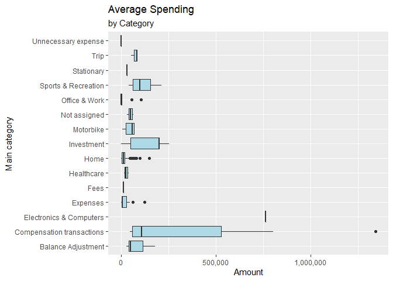

Budget Book Analysis
================
Raka Adinugraha
\- November 21, 2019

# About the data

This data is a record of my personal spending from January 2019 to
August 2019. During this period, I record every spending that occurs in
every account that I have which is, cash money, bank account, and
various saving box. The data itself was exported from ‘My Budget Book’
android app on my phone, and the all amount is in IDR. We mainly gonna
be focus the analysis on a monthly basis.

# Purpose

The purpose of this analysis is to see the spending trend over this
period and make it as a guide for future spending decisions to improve
finances conditions. Other than that, it also uses as an indicator of
how good or not I at doing the records of the spending.

# Processing the data

The datasets turned into a tibble. Preset Date and Amount as date and
number type respectively. The rest of the column will become character
type by default.

``` r
budget <- read_csv2("January-august_2019.csv", col_types = cols(
  Date = col_date(format = "%m/%d/%Y"),
  Amount = col_number()
))
```

    ## Using ',' as decimal and '.' as grouping mark. Use read_delim() for more control.

``` r
head(budget)
```

    ## # A tibble: 6 x 7
    ##   Date       Title     Comment `Main category` Subcategory Account   Amount
    ##   <date>     <chr>     <chr>   <chr>           <chr>       <chr>      <dbl>
    ## 1 2019-01-01 This sof~ <NA>    Office & Work   Software    Cash Mo~  -55000
    ## 2 2019-01-02 Extra fr~ <NA>    Income          <NA>        Saving ~    2000
    ## 3 2019-01-02 Yogurt    <NA>    Home            Food        Cash Mo~   -8100
    ## 4 2019-01-02 Dinner    <NA>    Home            Food        Cash Mo~  -18000
    ## 5 2019-01-02 Weekly c~ <NA>    Expenses        <NA>        Bank Ma~ -300000
    ## 6 2019-01-02 Weekly c~ <NA>    Expenses        <NA>        Cash Mo~  300000

Upon looking at the dataset, we can see there is some element of it we
can tweak. First, we can see that ‘Main category’ column name has a
space in it, that in my experience could be problematic when trying to
use it for plotting, so we need to change it. We also add a new
‘Month\_Year’ column that will help our further analysis.

``` r
budget <- rename(budget, Main_category = 'Main category')
budget$Month_Year <- format(as_date(budget$Date), '%Y-%m')
head(budget)
```

    ## # A tibble: 6 x 8
    ##   Date       Title Comment Main_category Subcategory Account  Amount
    ##   <date>     <chr> <chr>   <chr>         <chr>       <chr>     <dbl>
    ## 1 2019-01-01 This~ <NA>    Office & Work Software    Cash M~  -55000
    ## 2 2019-01-02 Extr~ <NA>    Income        <NA>        Saving~    2000
    ## 3 2019-01-02 Yogu~ <NA>    Home          Food        Cash M~   -8100
    ## 4 2019-01-02 Dinn~ <NA>    Home          Food        Cash M~  -18000
    ## 5 2019-01-02 Week~ <NA>    Expenses      <NA>        Bank M~ -300000
    ## 6 2019-01-02 Week~ <NA>    Expenses      <NA>        Cash M~  300000
    ## # ... with 1 more variable: Month_Year <chr>

Next, we create several data frame that will be used for our analysis.
spending\_data data frame will consist of all of our spending data. In
this data frame we also remove ‘Comment’ column because it contains
mostly about detailed notes like the amount of certain things bought, or
how much discount we get. On top of it, not every entry have their
comment column filed. Of course, we can make further analysis of it, but
it was beyond the scope of this analysis.

``` r
budget %>%
  filter(Main_category != 'Income' & Main_category != 'Saving') %>%
  select(-Comment) -> spending_data
head(spending_data)
```

    ## # A tibble: 6 x 7
    ##   Date       Title   Main_category   Subcategory Account  Amount Month_Year
    ##   <date>     <chr>   <chr>           <chr>       <chr>     <dbl> <chr>     
    ## 1 2019-01-01 This s~ Office & Work   Software    Cash M~  -55000 2019-01   
    ## 2 2019-01-02 Yogurt  Home            Food        Cash M~   -8100 2019-01   
    ## 3 2019-01-02 Dinner  Home            Food        Cash M~  -18000 2019-01   
    ## 4 2019-01-02 Weekly~ Expenses        <NA>        Bank M~ -300000 2019-01   
    ## 5 2019-01-02 Weekly~ Expenses        <NA>        Cash M~  300000 2019-01   
    ## 6 2019-01-02 Expense Unnecessary ex~ <NA>        Cash M~   -2000 2019-01

In the investment data frame, contains all data of the investment that
we made during the time period. We remove ‘Subcategory’ column because
all entry has the same subcategory.

``` r
spending_data %>%
  filter(Main_category == 'Investment') %>%
  select(-Subcategory) -> investment
head(investment)
```

    ## # A tibble: 6 x 6
    ##   Date       Title           Main_category Account       Amount Month_Year
    ##   <date>     <chr>           <chr>         <chr>          <dbl> <chr>     
    ## 1 2019-01-24 Gold investment Investment    Bank Mandiri -200000 2019-01   
    ## 2 2019-02-09 Gold investment Investment    Bank Mandiri -200000 2019-02   
    ## 3 2019-03-01 Gold investment Investment    Bank Mandiri -255000 2019-03   
    ## 4 2019-03-10 Mutual Funds    Investment    Bank Mandiri -200000 2019-03   
    ## 5 2019-03-11 Mutual Funds    Investment    Bank Mandiri  -50000 2019-03   
    ## 6 2019-04-01 Mutual Funds    Investment    Bank Mandiri  -50000 2019-04

As it name suggest, the income data frame contains all our income
labeled transaction.

``` r
income <- filter(budget, Main_category == 'Income')
head(income)
```

    ## # A tibble: 6 x 8
    ##   Date       Title Comment Main_category Subcategory Account Amount
    ##   <date>     <chr> <chr>   <chr>         <chr>       <chr>    <dbl>
    ## 1 2019-01-02 Extr~ <NA>    Income        <NA>        Saving~ 2.00e3
    ## 2 2019-01-07 Bonus <NA>    Income        <NA>        Bank M~ 4.00e4
    ## 3 2019-01-29 Inco~ <NA>    Income        Income      Bank M~ 1.70e6
    ## 4 2019-02-26 Inco~ <NA>    Income        Income      Bank M~ 1.70e6
    ## 5 2019-03-09 Gift  <NA>    Income        Income      Bank M~ 2.00e5
    ## 6 2019-03-30 Inco~ <NA>    Income        Income      Bank M~ 1.70e6
    ## # ... with 1 more variable: Month_Year <chr>

savings consist of the data of a small amount of money we save.

``` r
budget %>%
  filter(Main_category == 'Saving') %>%
  select(-Comment) -> savings
head(savings)
```

    ## # A tibble: 6 x 7
    ##   Date       Title     Main_category Subcategory Account  Amount Month_Year
    ##   <date>     <chr>     <chr>         <chr>       <chr>     <dbl> <chr>     
    ## 1 2019-01-03 4K Routi~ Saving        <NA>        Cash Mo~  -4000 2019-01   
    ## 2 2019-01-03 4K Routi~ Saving        <NA>        Saving ~   4000 2019-01   
    ## 3 2019-01-10 4K Routi~ Saving        <NA>        Cash Mo~  -4000 2019-01   
    ## 4 2019-01-10 4K Routi~ Saving        <NA>        Saving ~   4000 2019-01   
    ## 5 2019-01-17 4K Routi~ Saving        <NA>        Cash Mo~  -4000 2019-01   
    ## 6 2019-01-17 4K Routi~ Saving        <NA>        Saving ~   4000 2019-01

# Visualization

The visualization of the data can help the analysis by giving more
insight into the data itself. I use ggplot2 as the main tool for
visualizing the data, and the tidyverse package library for manipulating
the data.

By using plotly with its ggplotly() function to the ggplot output, we
can convert the ggplot output to plotly output to use hovering tool to
see the detail of every point. Unfortunately, this does not work with
the .rmd file for github document. But it can be reproduced in R Studio
viewer tab, by simply using ggplotly() to their respective plot output.

## Spending over time

With this visualization, we can see the entirety of the spending data.
With this, we also can identify every spike in our spending and
determined what is the necessary step we can take to prevent that in the
future, if possible. There is a consistent spike in every month and
another major spike outlier that we can spot.

``` r
spending_data %>%
  ggplot(aes(x = Date, y = abs(Amount))) +
  geom_line() +
  labs(y = "Amount") +
  scale_y_continuous(labels = comma) +
  theme_minimal() -> P1
P1
```

<!-- -->

``` r
# ggplotly(P1)
```

## Spending by Category

In this section we will see several plots of spending divided by the
Main category.

### Spending/Month by Category

With this plot, we can see the highest spending happen in April, mainly
contributed by the general expenses Main category and compensation
transaction. The expenses category have a relatively high amount compare
to other spending category, almost all were above to 2 million only in
August it was below. We also can see the Home category also has
consistently high amount all month, only in June it dip below 500K.

``` r
spending_data %>%
  group_by(Month = month(Date), Year = year(Date), Main_category) %>%
  summarise(Amount = sum(abs(Amount))) %>%
  ggplot(aes(x = Month, y = Amount, fill = Main_category)) +
  geom_bar(stat = 'identity', position = position_dodge()) +
  labs(x = "", title = "Spending/Month", subtitle =  "by Category", fill = "Category") +
  scale_x_continuous(
    breaks = c(1, 2, 3, 4, 5, 6, 7, 8), 
    label = c("Jan", "Feb", "Mar", "Apr", "May", "Jun", "Jul", "Aug")) +
  scale_y_continuous(labels = comma)
```

<!-- -->

### Deeper dive into Balance Adjustment and Expenses category

Balance Adjustment category and compensation transactions category exist
indicating there were a considerably flaws in our way of recording the
spending and income data. These categories basically is a lost records
of our spending data, this is known by manual amount checking on all our
account by the end of every month. Balance adjustment and Compensation
transactions mostly indicating a considerable number of transactions are
not recorded properly. If combined these two categories also happen to
be the third-largest records of all entire spending.

``` r
spending_data %>%
  filter(Main_category %in% c("Balance Adjustment", "Compensation transactions")) %>%
  ggplot(aes(x = Month_Year, y = Amount, fill = Title)) +
  geom_col(position = position_dodge2()) +
  labs(x = "Date", title = "Balance Adjustment") +
  scale_y_continuous(labels = comma) +
  scale_fill_discrete(name = "")
```

<!-- -->

Expenses Main category is quite interesting because so far its the
largest amount of spending by itself. But from the previous plot, we
still can’t see what it consist of. So, by examining deeper into this
category we hope can get more insight.

``` r
spending_data %>%
  filter(Main_category == "Expenses") %>%
  distinct(Title)
```

    ## # A tibble: 6 x 1
    ##   Title                        
    ##   <chr>                        
    ## 1 Weekly cash out              
    ## 2 Scanning Sertificate         
    ## 3 Scanning&printing Sertificate
    ## 4 Printings                    
    ## 5 LaC Fee                      
    ## 6 JLPT N5 Registration

Weekly cash out is when we take money from ATM when we need cash money.
Basically it is not really an expense, it just a money transfer event.
But it is still recorded as so, because of the My Budget Book app
records every transaction that involve taking any amount of money from
an account as an expense. Therefore if we see to it the Amount column,
it counts as negative.  
Now, let’s see how much the ‘true’ Expenses category is with the plot
below.

``` r
filter(spending_data, Main_category == "Expenses" & Title != "Weekly cash out") %>%
  ggplot(aes(x = Title, y = abs(Amount))) +
  geom_col() +
  labs(y = "Amount") +
  coord_flip()
```

<!-- -->

With this finding in mind, we’ll adjust the data more for the next
analysis.

And here we can see the new plot for Spending/Month by Category, and
also the total spending of all Main category for the entire time period.

``` r
spending_data %>%
  filter(Title != "Weekly cash out") %>%
  group_by(Month = month(Date), Year = year(Date), Main_category) %>%
  summarise(Amount = sum(abs(Amount))) %>%
  ggplot(aes(x = Month, y = Amount, fill = Main_category)) +
  geom_bar(stat = 'identity', position = position_dodge()) +
  labs(x = "", title = "Spending/Month", subtitle =  "by Category", fill = "Category") +
  scale_fill_viridis_d(option = 'inferno') +
  scale_x_continuous(
    breaks = c(1, 2, 3, 4, 5, 6, 7, 8), 
    label = c("Jan", "Feb", "Mar", "Apr", "May", "Jun", "Jul", "Aug")) +
  scale_y_continuous(labels = comma)
```

<!-- -->

``` r
spending_data %>%
  filter(Title != "Weekly cash out") %>%
  group_by(Main_category) %>%
  summarise(Amount = sum(abs(Amount))) %>%
  ggplot(aes(x = Main_category, y = Amount)) +
  geom_point(size = 5, color = 'firebrick') +
  labs(x = "Main Category") +
  scale_y_continuous(labels = comma) +
  theme_minimal() +
  coord_flip()
```

<!-- -->

### Average Spending/Category

We can see here that a few categories only occurs a few or even a single
time. Investment has the highest average value of transactions that
happen multiple times. There is also an outlier with high value in
compensation transactions.

``` r
spending_data %>%
  filter(Title != "Weekly cash out") %>%
  ggplot(aes(x = Main_category, y = abs(Amount))) +
  geom_boxplot(fill = 'lightblue') +
  labs(x = "Main category", y = "Amount", title = "Average Spending", subtitle = "by Category") +
  scale_y_continuous(labels = comma) +
  coord_flip()
```

<!-- -->

# Investment, Savings, and Income

Below we will see the plot figures for investment, savings, Coin vault,
and income. From the beginning of the year, I invest some of the money
on two things, gold and mutual funds. I started gold earlier because it
was a relatively straightforward type of investment. While for mutual
funds, I personally need some time to understand how it works and how
big the risk involved. I committed myself to invest at least 200K on
gold every month, and for mutual funds, I invest what’s left for that
month. In May, I only invest 50k on gold. So for compensated that, I
decided in July to double the amount for gold investment.

``` r
ggplot(investment, aes(x = Title, y = abs(Amount), fill = Title)) +
  geom_col() +
  labs(x = "", y = "Amount", title = "Invesment/Month") +
  scale_y_continuous(labels = comma) +
  theme(legend.position = 'none') +
  facet_wrap(. ~ Month_Year)
```

<!-- -->

Every week I routinely save 4K to Saving Box account. Here we can see
the cumulative amount saved for every month.

``` r
savings %>%
  filter(Account != "Cash Money") %>%
  ggplot(aes(x = Month_Year, y = Amount)) +
  geom_col() + 
  labs(x = "Date", title = "Savings/Month") +
  theme_minimal()
```

<!-- -->

Sometimes I get the coin as changes when buying something. I save all
those coins in Coin vault account. Gather it much enough, to eventually
deposit it to the bank at a later time.

``` r
budget %>%
  filter(Account == "Coin Vault") %>%
  ggplot(mapping = aes(x = Date, y = Amount)) +
  geom_point(color = 'firebrick' ) + 
  theme_minimal()
```

<!-- -->

The plot below shows data of our income, Which is mainly is my monthly
allowance. The amount in July skyrocketed because the monthly allowance
for that month actually gets transferred to me in early July, not like
another month which is come at the end of the month before it.

``` r
income %>%  
  group_by(Month = month(Date)) %>%
  summarise(Amount = sum(Amount)) %>%
  ggplot(aes(x = Month, y = Amount)) +
  geom_col(fill = 'darkgreen', position = position_identity()) +
  labs(x = "", title = 'Income/Month') +
  scale_x_continuous(
    breaks = c(1, 2, 3, 4, 5, 6, 7, 8),
    label = c("Jan", "Feb", "Mar", "Apr", "May", "Jun", "Jul", "Aug")) +
  scale_y_continuous(labels = comma) +
  theme_minimal()
```

<!-- -->

# Frequency of Occurrence

Here we can see that Home, was the most assigned Main category for the
entire spending, followed by Expenses and Saving. And if we see to plot
figure for Subcategory, the top two was the NA’s and Food, meaning most
assigned Subcategory for every Main category is either Food or no
Subcategory.

``` r
ggplot(budget, aes(x = fct_rev(fct_infreq(Main_category)))) +
  geom_bar() +
  labs(x = "Main Category", y = "Count") +
  theme_minimal() +
  coord_flip()
```

<!-- -->

``` r
ggplot(budget, aes(x = fct_rev(fct_infreq(Subcategory)))) +
  geom_bar() +
  labs(x = "Subcategory", y = "Count") +
  theme_minimal() +
  coord_flip()
```

<!-- -->

Because most of Main category doesn’t have their subcategory assigned,
let’s plot both the Main category with their Subcategory assigned and
unassigned.

``` r
budget %>%
  filter(Subcategory != is.na(NA)) %>%
  ggplot(aes(fct_rev(fct_infreq(Main_category)))) +
  geom_bar(aes(fill = Subcategory), position = position_identity()) +
  scale_fill_viridis_d(option = "inferno") +
  labs(x = "Main Category",
       y = "Count",
       title = "Main Category", 
       subtitle = "with assigned Subcategory") +
  theme_minimal() + 
  coord_flip()
```

<!-- -->

``` r
budget %>%
  replace_na(list(Subcategory = "None")) %>%
  filter(Subcategory == "None") %>%
  ggplot(aes(fct_rev(fct_infreq(Main_category)))) +
  geom_bar(position = position_dodge2()) +
  labs(x = "Main Category",
       title = "Main Category", 
       subtitle = "with unassigned Subcategory") +
  theme_minimal() +
  coord_flip()
```

<!-- -->

And here we see that most of our transactions happen with Cash money
account.

``` r
budget %>%
  ggplot(aes(x = Account)) +
  geom_bar(fill = "dodgerblue4") +
  theme_minimal()
```

<!-- -->

# Time Series Clustering

I need to reformat the data to n X p matrix with ni NA for Amount to
perform time-series clustering using TSclust package. From the budget
data frame, I select Month\_Year, Main\_category, And Amount column.
Group it by Main\_category and Month\_Year, and summarise the total
amount for each month. Then it turned into matrix format and transpose
it to make categories as the row and months as the column. This
manipulated data is carried over to the next section.

``` r
budget %>%
  filter(Title != "Weekly cash out") %>%
  select(Month_Year, Main_category, Amount) %>%
  group_by(Main_category, Month_Year) %>%
  summarise(Amount = sum(abs(Amount))) %>%
  spread(key = Main_category, value = Amount) -> budget_re

budget_re[is.na(budget_re)] <- 0

  # to matrix format
budget_re <- t(as.matrix(budget_re))
colnames(budget_re) <- budget_re[1,]
budget_re <- budget_re[-1,]
Main_category <- rownames(budget_re)

  # Time series plot
par(mfrow= c(3,6))
par(mar = c(2, 2, 1, 0))
for (i in 1:17) {
  plot(budget_re[i,], main=rownames(budget_re)[i], type = 'l')
}
```

<!-- -->

# Dissimilarity Matrix

We can tell a similarity between categories using their correlation
value. We will generate a dissimilarity matrix, which is a measure of
dissimilarity. The correlation is measured by range (0,2), where 2 is
the most dissimilar categories.

``` r
budget_re <- apply(budget_re, 2, as.numeric)
rownames(budget_re) <- Main_category

diss_mat <- diss(budget_re, "COR")
summary(diss_mat)
```

    ##    Min. 1st Qu.  Median    Mean 3rd Qu.    Max. 
    ##  0.4622  1.2269  1.4832  1.3831  1.5665  1.9340

``` r
melted_diss <- melt(as.matrix(diss_mat))
head(melted_diss)
```

    ##                        Var1               Var2    value
    ## 1        Balance Adjustment Balance Adjustment 0.000000
    ## 2 Compensation transactions Balance Adjustment 1.596101
    ## 3   Electronics & Computers Balance Adjustment 1.554665
    ## 4                  Expenses Balance Adjustment 1.629704
    ## 5                      Fees Balance Adjustment 1.093344
    ## 6                Healthcare Balance Adjustment 1.533586

``` r
  # Dissimilarity matrix plot
ggplot(melted_diss, aes(x= Var1, y = Var2)) +
  geom_tile(aes(fill = value)) +
  scale_fill_viridis_c(option = "inferno") +
  theme(axis.text.x = element_text(angle = 45, size = 8, hjust = 1))
```

<!-- -->

# Conclusion

Based on this analysis, I will try to reasonably reduce the spending on
food. So the budget can be spent elsewhere more productive like an
investment for example. Also at the same time try to increase my savings
amount. This analysis also makes it clear that there is a lot that needs
to be improved in our way to record the spending and income data.
